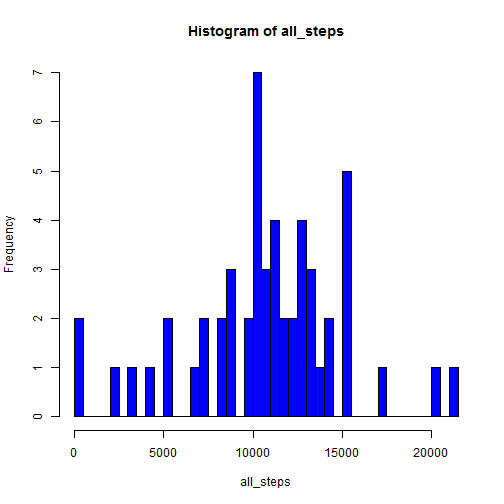
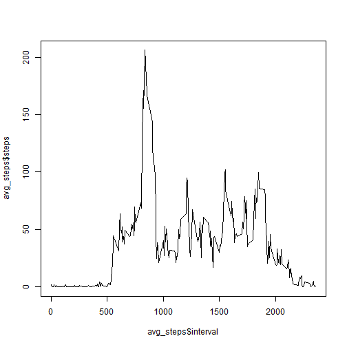
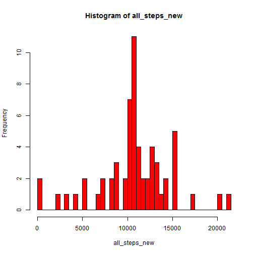

==========================================================================

#### Loading and processing data

```r
data <- read.csv("C:/Users/Flex/Documents/RR/activity.csv", 
                 colClasses = c("numeric", "character", "numeric"))
```

#### Total number of steps taken per day

```r
all_steps <- tapply(data$steps, data$date, sum)
hist(all_steps, breaks = 40, col = "blue")
```

 

```r
mean(all_steps, na.rm=TRUE)
```

```
## [1] 10766.19
```

```r
median(all_steps, na.rm=TRUE)
```

```
## [1] 10765
```

#### Average daily activity pattern

```r
avg_steps  <- aggregate(data$steps ~ data$interval,data=data, mean, na.rm=TRUE)
names(avg_steps)  <- c("interval","steps")
plot(avg_steps$interval, avg_steps$steps,type="l")
```

 


```r
row_number  <- which(avg_steps$steps==max(avg_steps$steps))
max_interval  <- avg_steps[row_number,1]
print(paste0("Interval with max avg. steps: ", max_interval))
```

```
## [1] "Interval with max avg. steps: 835"
```

#### Imputing missing values 

##### 1. Total number of missing values

```r
missing_val  <- sum(is.na(data))
print(paste0("Total number of missing values: ", missing_val))
```

```
## [1] "Total number of missing values: 2304"
```

##### 2. Creating a new dataset and filling in NA values

###### Strategy discribtion:
- We make a copy of the data set
- We execute a FOR loop to find NA values
- If the NA value is found we record a particular interval
- We use the interval to find avg. value in the avg_steps data.frame
- We replace the NA value in the new data set with the avgerage of steps

```r
data_new  <- data
for(i in seq_along(data_new$steps)){
      if(is.na(data_new[i,1])==TRUE){
            int  <- data_new$interval[i]
            data_new[i,1]  <- avg_steps[which(avg_steps$interval==int),2]
      }
}
```

##### 3. Plotting histogram of the new dataset (+mean/meadian)

```r
all_steps_new <- tapply(data_new$steps, data_new$date, sum)
hist(all_steps_new, breaks = 40, col = "red")
```

 

```r
mean(all_steps_new, na.rm=TRUE)
```

```
## [1] 10766.19
```

```r
median(all_steps_new, na.rm=TRUE)
```

```
## [1] 10766.19
```

#### Differences in activity patterns between weekdays and weekends

```r
library(lattice)
data_new$day <- factor(weekdays(as.Date(data_new$date)))
part1 = c("Monday", "Tuesday", "Wednesday", "Thursday", "Friday")
part2 = c("Saturday", "Sunday")
levels(data_new$day) <- list(weekday = part1, weekend = part2)
data_agg <- aggregate(data_new$steps, by=list(data_new$interval, data_new$day), mean)
names(data_agg) <- c("interval", "day", "steps")
xyplot(steps ~ interval | day, data=data_agg, layout=c(1,2), type="l" )
```

 

